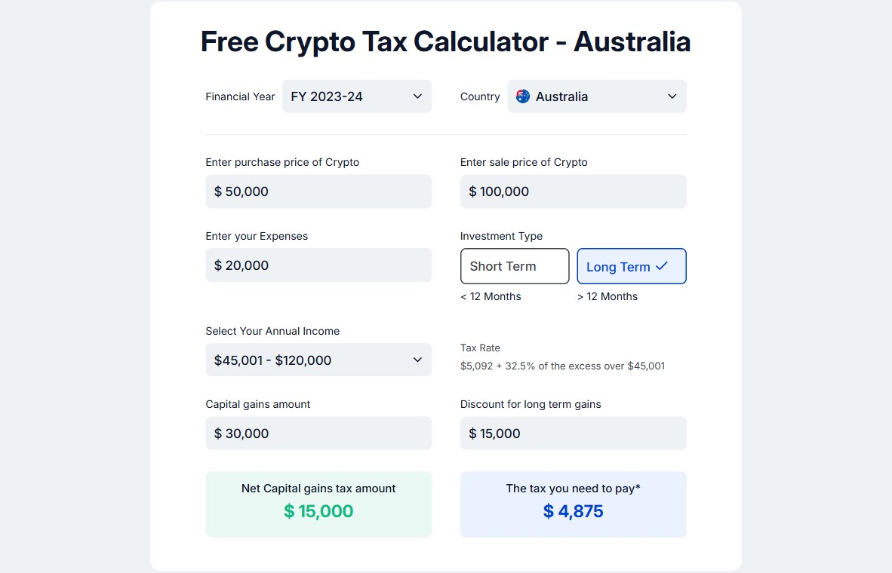

# 💸 Capital Gains Tax Calculator (Australia)

This is a simple web-based calculator to compute **Capital Gains Tax** (CGT) based on user input such as purchase/sale prices, expenses, investment type, and annual income — using Australian tax rules.

---

## 📸 Project Overview

This app calculates:

-   **Capital Gains Amount**
-   **Discount (for Long Term Gains)**
-   **Net Capital Gains**
-   **Applicable Tax Bracket**
-   **Tax Payable**

The tax logic is based on Australian income tax slabs.

---

## 🧱 Components Preview

---

## ✅ Functionalities Implemented

-   User input for:
    -   Purchase Price
    -   Sale Price
    -   Expenses
    -   Investment Type (Short-Term / Long-Term)
    -   Annual Income (Dropdown)
-   Automatically calculates:
    -   Capital Gains
    -   50% Discount (only for long-term & positive gain)
    -   Net Capital Gains
    -   Tax Bracket based on income
    -   Tax Payable on gains
-   Conditional UI:
    -   Hides capital gain/discount for short-term investments
-   Formatted numbers (with commas)
-   Controlled input state using `useState` and logic separation using `useEffect`

---

## 📦 Extra Packages Used

| Package       | Use                         |
| ------------- | --------------------------- |
| `classnames`  | Conditional class styling   |

---

## 📚 Learnings

-   Working with real-world tax logic and conditionally applying rules
-   Modularizing `useEffect` hooks effectively
-   Managing derived state calculations based on multiple dependencies
-   Using dropdown inputs with value-label pairs
-   Handling conditional rendering based on logic
-   Preventing unnecessary state updates to avoid re-renders

---

## 🚀 Future Improvements

-   Add PDF export or print option for results
-   Store historical calculation records (localStorage or DB)
-   Integrate with live ATO API for up-to-date tax brackets (if available)
